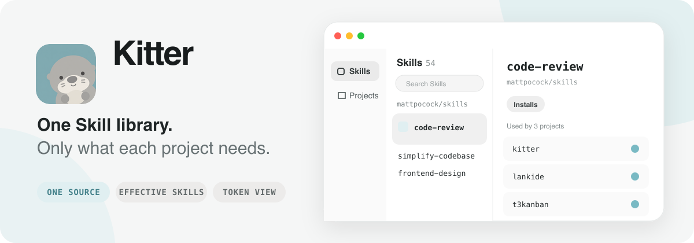
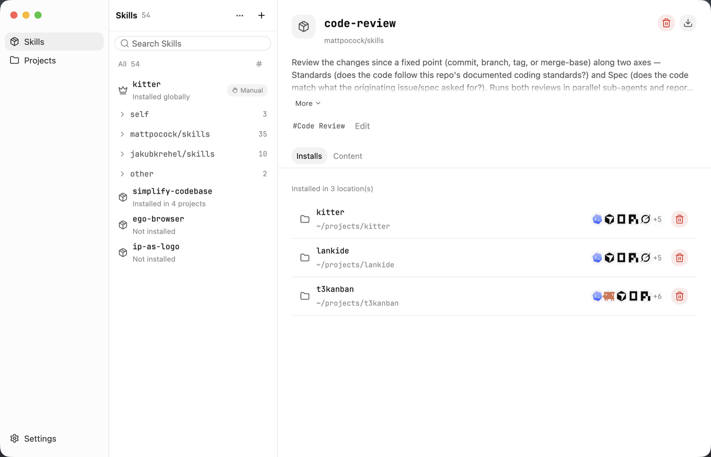
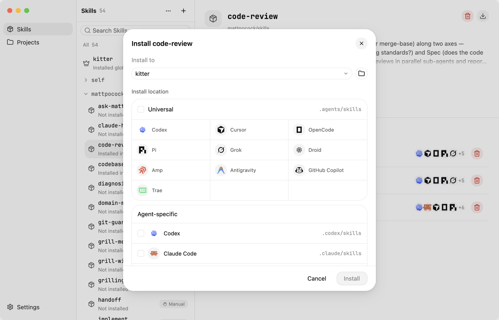
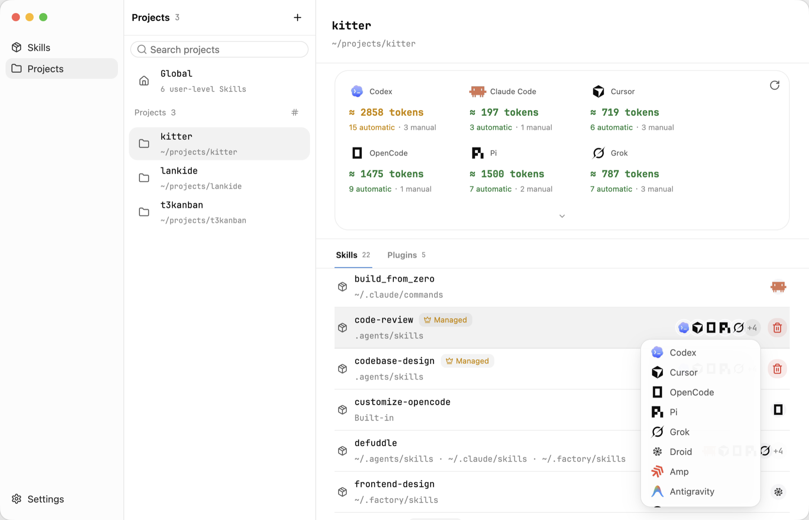

<p align="center">
  
</p>

<p align="center">
  <a href="./README.zh-CN.md">简体中文</a>
</p>

<p align="center">
  <a href="./LICENSE"></a>
  
  
</p>

<p align="center"><strong>One Skill library. Every project gets only what it needs.</strong></p>

Skills are easy to install and surprisingly hard to live with. Once you work across several projects, the same Skills end up copied into different directories, drift out of sync, and become difficult to update with confidence. Installing everything globally is not the answer either—each project needs a different combination.

Kitter gives every Skill one maintained home, then links it only into the projects that need it. The native desktop app and CLI share the same local-first Rust core. There is no account, no server, and no background indexer.

## Why Kitter

An Agent Skill should be a capability you own—not a disposable folder copied into every project.

Kitter is built around three defaults:

- **One maintained source** — keep one canonical copy of each Skill instead of creating update drift.
- **Project first** — install framework, workflow, and task-specific Skills where they are useful, not everywhere.
- **Minimal global scope** — reserve global installation for the small set of Skills that genuinely belongs in almost every project.

This makes a growing library easier to understand in both directions: open a Skill to see every project using it, or open a project to see the complete set of Skills its Agents actually discover—even Skills that Kitter does not manage.

Kitter also estimates the automatically loaded Skill metadata for each Agent. That makes context cost visible early, so you can spot an overly broad Skill set, shorten bloated metadata, move rarely used capabilities to manual invocation, or remove duplicates before they become permanent overhead.

## Install Kitter

[Download the latest macOS release](https://github.com/what1f/kitter/releases/latest), unzip it, and move `Kitter.app` to `/Applications`.

Kitter is not yet signed with an Apple Developer ID. On first launch, try **Control-click → Open** in Finder. If macOS still blocks the app, remove only its quarantine attribute after confirming that it came from the official Kitter release:

```bash
xattr -dr com.apple.quarantine /Applications/Kitter.app
```

The desktop app bundles the CLI used by its built-in Kitter Skill. Separate CLI packages for macOS, Windows, and Linux are available from [GitHub Releases](https://github.com/what1f/kitter/releases/latest), so the CLI and Agent Skill can also be used without the desktop app.

## Manage your Skills with Kitter

### 1. Build one library

Use **+** to add Skills from a local folder, GitHub or a skills.sh-compatible source, or a Claude plugin source. If Skills are already scattered across projects, choose **Existing installations** to inspect and adopt them without moving their source directories.

Kitter keeps one maintained source for each Skill. Open its **Installs** tab to immediately see every project using it, every installation location, and the Agents that can discover it.

<p align="center">
  
</p>

### 2. Install only where needed

Select a Skill, choose a project, then install it into the shared `.agents/skills` directory or an Agent-specific directory. Kitter creates managed links instead of independent copies, so projects can use different combinations without creating update drift.

<p align="center">
  
</p>

Use a user-level installation only when a Skill remains useful in almost every project. If a plugin already provides the same capability, check the project view before installing another copy.

### 3. Verify what is actually active

Open **Projects** to see the complete effective Skill set for every Agent—not just installations managed by Kitter. The view discovers project, parent, user-level, built-in, and plugin-provided capabilities, then shows where each one came from.

The per-Agent token estimate approximates the Skill metadata loaded into initial context. Use it as an optimization signal: identify oversized automatic Skill sets, simplify descriptions, make occasional Skills manual, and remove redundant capabilities.

<p align="center">
  
</p>

### 4. Update once

Run **Check for updates** from the desktop app or use `kitter check` and `kitter update`. Every managed project continues to use the same maintained source.

The equivalent CLI workflow is intentionally small:

```bash
kitter add npx https://github.com/owner/repository --skill skill-a
kitter install skill-a --project /path/to/project --target universal
kitter project /path/to/project
kitter update skill-a
```

## Standalone CLI and Agent Skill

You do not need the desktop app to use Kitter. Download the standalone CLI from [GitHub Releases](https://github.com/what1f/kitter/releases/latest), put `kitter` on your `PATH`, and install the [`$kitter` Skill](./resources/skills/kitter) directly:

```bash
npx skills add what1f/kitter --skill kitter
```

The Skill lets an Agent inspect the current machine, add or adopt Skill sources, install the right project combination, and verify the result through the CLI. When installed by the desktop app it uses the bundled CLI; when installed independently it uses the standalone `kitter` command and can guide you through downloading it from an official Release when missing.

<details>
<summary><strong>Build from source</strong></summary>

```bash
git clone https://github.com/what1f/kitter.git
cd kitter
cargo run --release --locked --features desktop --bin kitter-desktop
```

</details>

## Platform status

- **macOS** — desktop application and standalone CLI.
- **Windows and Linux** — standalone CLI available now; desktop applications are coming soon. Kitter uses GPUI's native Windows and Linux backends, but those desktop builds still need validation on real systems.

## Local data

Kitter stores configuration and source records in the operating system's application-data directory. Skill contents live in the library directory:

| Platform | Default Skill library |
| --- | --- |
| macOS | `~/Library/Application Support/Kitter/skills` |
| Windows | `%LOCALAPPDATA%\Kitter\skills` |
| Linux | `$XDG_DATA_HOME/Kitter/skills` or `~/.local/share/Kitter/skills` |

View or change the location with `kitter library` and `kitter library --set /absolute/path`.

## Contributing

Issues and pull requests are welcome. Please open an [issue](https://github.com/what1f/kitter/issues) before starting a large behavioral or UI change so the scope can be aligned first.

If Kitter makes your Skill setup calmer, consider [starring the repository](https://github.com/what1f/kitter). It helps more multi-project developers find it.

## License

Kitter is available under the [Apache License 2.0](./LICENSE). Licenses for bundled fonts, icons, and other third-party material are listed in [THIRD_PARTY_LICENSES.md](./THIRD_PARTY_LICENSES.md).
