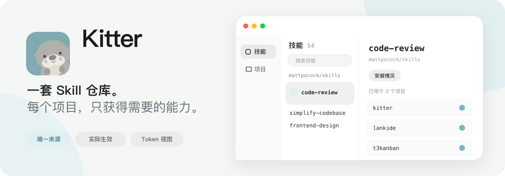
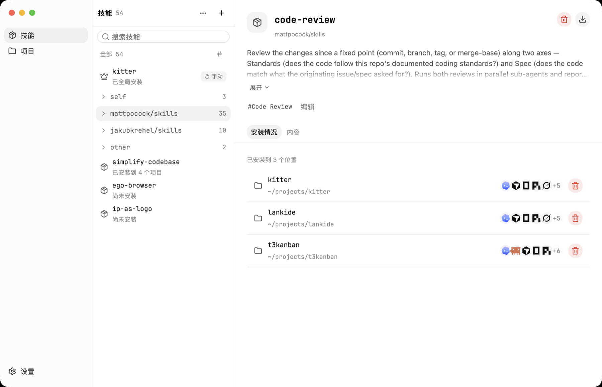
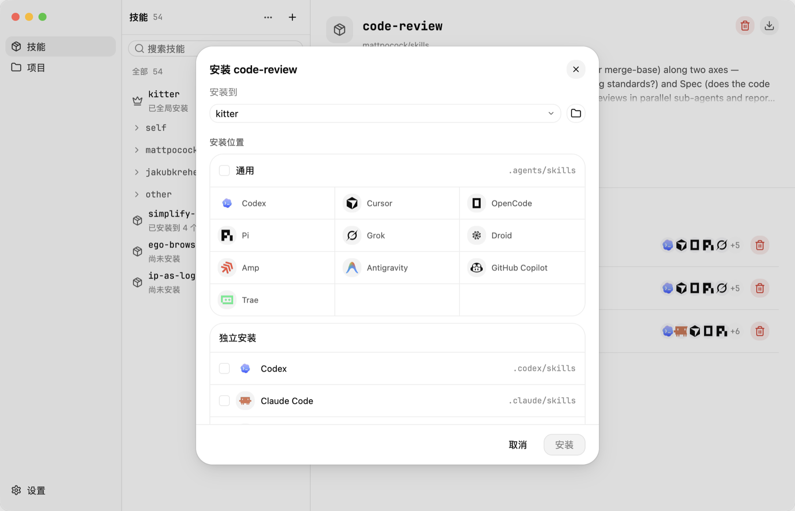
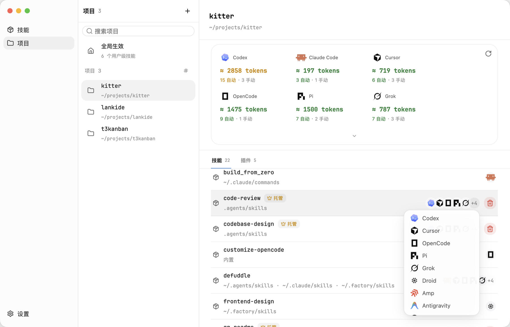

<p align="center">
  
</p>

<p align="center">
  <a href="./README.md">English</a>
</p>

<p align="center">
  <a href="./LICENSE"></a>
  
  
</p>

<p align="center"><strong>一套 Skill 仓库，让每个项目只获得自己需要的 Skill。</strong></p>

安装 Skill 很容易，长期维护却很难。当你同时开发多个项目，同一个 Skill 会逐渐散落在不同目录中，形成多份副本，更新也开始彼此漂移。把所有 Skill 全部安装到全局同样不可行——每个项目需要的组合都不一样。

Kitter 为每个 Skill 保留一份长期维护的来源，再把它连接到真正需要它的项目。原生桌面应用和 CLI 共用同一套本地优先 Rust 核心：不需要账号，没有服务器，也不会在后台建立索引。

## 为什么做 Kitter

Agent Skill 应该是你长期拥有的能力资产，而不是复制进每个项目后就失去来源的临时文件夹。

Kitter 建立在三个默认原则上：

- **每个 Skill 只维护一份**——保留唯一可信来源，不再让多份副本各自漂移。
- **项目优先**——框架、工作流和任务相关的 Skill 应该安装到真正使用它们的项目，而不是到处存在。
- **少量全局**——只有几乎每个项目都需要的少数 Skill，才适合安装到用户级全局目录。

这样，即使 Skill 越来越多，也可以从两个方向理解整个系统：打开一个 Skill，立即看到哪些项目正在使用它；打开一个项目，看到其中各个 Agent 实际能发现的全部 Skill——包括并非由 Kitter 托管的来源。

Kitter 还会估算每个 Agent 自动载入的 Skill 元数据 token。上下文成本因此能更早暴露出来，方便发现过于宽泛的 Skill 组合、精简冗长的元数据、把低频能力改为手动调用，或清除重复能力，避免它们持续占用上下文。

## 安装 Kitter

[下载最新 macOS 版本](https://github.com/what1f/kitter/releases/latest)，打开 DMG 后将 `Kitter.app` 拖入 `Applications`。

Kitter 暂时没有 Apple Developer ID 签名。首次启动时，请先在 Finder 中 **按住 Control 点按 → 打开**。如果 macOS 仍然阻止运行，请确认应用来自 Kitter 官方 Release，再只移除它的隔离属性：

```bash
xattr -dr com.apple.quarantine /Applications/Kitter.app
```

桌面应用内置了供 Kitter Skill 使用的 CLI。GitHub Release 另行提供 macOS、Windows 和 Linux 的独立 CLI 包，因此不安装桌面应用也可以单独使用 CLI 和 Agent Skill。

## 使用 Kitter 管理 Skill

### 1. 建立一套 Skill 仓库

点击 **+**，可以从本地目录、GitHub、兼容 skills.sh 的来源或 Claude 插件来源添加 Skill。如果 Skill 已经散落在多个项目中，可以选择 **已有安装**，在不搬动源目录的前提下检查并纳管它们。

Kitter 为每个 Skill 保留一份长期维护的来源。打开它的 **安装情况**，就能立即看到哪些项目正在使用它、每个安装位置，以及哪些 Agent 可以发现它。

<p align="center">
  
</p>

### 2. 只安装到需要的项目

选中一个 Skill 和目标项目，再选择共享的 `.agents/skills` 目录或指定 Agent 的目录。Kitter 建立托管链接，而不是复制出互不相关的副本，因此每个项目都可以拥有自己的 Skill 组合，同时保持来源一致。

<p align="center">
  
</p>

只有当一个 Skill 几乎在每个项目中都长期有用时，才考虑用户级全局安装。如果插件已经提供相同能力，请先在项目视图确认实际状态，避免重复安装。

### 3. 验证实际生效内容

打开 **项目**，可以看到每个 Agent 完整的生效 Skill 集合，而不只是 Kitter 托管的安装。Kitter 会发现项目级、上级目录、用户级、内置及插件提供的能力，并标明每一项来自哪里。

每个 Agent 的 token 估算近似表示初始上下文中自动载入的 Skill 元数据。可以把它作为优化信号：找出过大的自动 Skill 集合、精简描述、将低频 Skill 改为手动调用，并移除重复能力。

<p align="center">
  
</p>

### 4. 只更新一次

在桌面应用中执行 **检查更新**，或使用 `kitter check` 和 `kitter update`。所有托管项目会继续使用同一份维护来源。

对应的 CLI 工作流很简洁：

```bash
kitter add npx https://github.com/owner/repository --skill skill-a
kitter install skill-a --project /path/to/project --target universal
kitter project /path/to/project
kitter update skill-a
```

## 独立 CLI 与 Agent Skill

使用 Kitter 不要求安装桌面应用。你可以从 [GitHub Releases](https://github.com/what1f/kitter/releases/latest) 下载独立 CLI，将 `kitter` 放入 `PATH`，然后直接安装 [`$kitter` Skill](./resources/skills/kitter)：

```bash
npx skills add what1f/kitter --skill kitter
```

这个 Skill 让 Agent 可以通过 CLI 盘点当前机器、添加或纳管 Skill 来源、为项目安装正确组合并验证结果。由桌面应用安装时，它使用随包附带的 CLI；独立安装时，它使用 `PATH` 中的 `kitter` 命令，缺少 CLI 时也会引导你从官方 Release 下载。

<details>
<summary><strong>从源码构建</strong></summary>

```bash
git clone https://github.com/what1f/kitter.git
cd kitter
cargo run --release --locked --features desktop --bin kitter-desktop
```

</details>

## 平台状态

- **macOS**——提供桌面应用和独立 CLI。
- **Windows 与 Linux**——现已提供独立 CLI，桌面应用即将支持。Kitter 使用 GPUI 的原生 Windows 和 Linux 后端，但桌面构建仍需在真实系统中完成验证。

## 本地数据

Kitter 将配置和来源记录保存在操作系统的应用数据目录，Skill 内容保存在仓库目录：

| 平台 | 默认 Skill 仓库 |
| --- | --- |
| macOS | `~/Library/Application Support/Kitter/skills` |
| Windows | `%LOCALAPPDATA%\Kitter\skills` |
| Linux | `$XDG_DATA_HOME/Kitter/skills` 或 `~/.local/share/Kitter/skills` |

使用 `kitter library` 和 `kitter library --set /absolute/path` 查看或修改位置。

## 参与贡献

欢迎提交 Issue 和 Pull Request。如果准备进行较大的行为或 UI 改动，请先创建 [Issue](https://github.com/what1f/kitter/issues) 对齐范围。

如果 Kitter 让你的 Skill 管理变得更从容，欢迎为[项目点一颗 Star](https://github.com/what1f/kitter)，让更多同时维护多个项目的开发者看到它。

## 许可证

Kitter 使用 [Apache License 2.0](./LICENSE) 开源。内置字体、图标及其他第三方素材的许可证见 [THIRD_PARTY_LICENSES.md](./THIRD_PARTY_LICENSES.md)。
